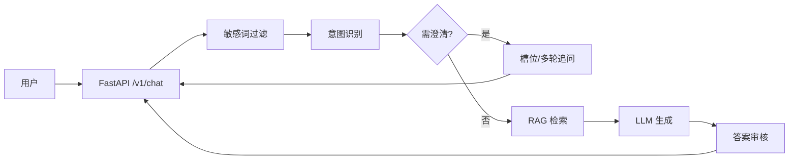

# GovFlow 项目架构设计（MVP / P0）

**版本**：0.1  
**日期**：2026年4月11日  
**范围**：实现需求文档 [Requirments.md](../Requirments.md) 中 **P0**（准确问答 + 模糊意图澄清），P1/P2 仅预留扩展点。

---

## 1. 目标与原则

| 原则 | 说明 |
|------|------|
| **严禁编造** | 无检索命中时不走自由生成；返回官方热线与转人工指引（`fallback`）。 |
| **来源可溯** | 回答携带 `sources`（标题、文件路径/未来文号 URI、分数）。 |
| **可扩展** | RAG、LLM、会话存储、审核均以协议/接口形态存在，MVP 用 Mock 实现。 |
| **数据流可追溯** | API 返回 `stages_executed`，便于对接日志与 SLA 监控。 |

---

## 2. 逻辑架构（与需求 5.2 对齐）



**P0 数据流（已实现骨架）**：

用户提问 → 敏感词过滤 → 意图识别 →（信息不全则槽位追问）→ RAG → LLM → 答案审核 → 返回。

---

## 3. 物理与仓库结构

```text
GovFlow/
├── docs/
│   └── ARCHITECTURE.md          # 本文档
├── knowledge_base/              # 本地政务知识（示例 Markdown/TXT）
│   ├── 社保/
│   └── 户籍/
├── src/govflow/
│   ├── main.py                  # FastAPI 应用入口
│   ├── config.py                # pydantic-settings，环境变量前缀 GOVFLOW_
│   ├── api/                     # HTTP 层
│   │   ├── deps.py              # 编排器单例注入
│   │   └── routes/chat.py
│   ├── models/schemas.py        # 请求/响应 Pydantic 模型
│   ├── domain/                  # 与框架无关的领域类型
│   ├── repositories/            # 会话等仓储（MVP：内存）
│   └── services/
│       ├── safety/              # 敏感词（占位，可换审核服务）
│       ├── intent/              # 意图 + 是否需澄清
│       ├── clarification/       # 槽位状态机（配置化 TODO）
│       ├── rag/                 # Retriever 协议 + MockKeywordRetriever
│       ├── llm/                 # LLMClient + Auditor 协议 + Mock
│       └── pipeline/            # ChatOrchestrator 编排
├── tests/
├── pyproject.toml
├── requirements.txt
└── .env.example
```

**扩展位（TODO 已标在代码中）**：

- `services/rag/`：接入 Chroma + BGE 嵌入、混合检索、元数据（部门、发布日期）。
- `services/llm/`：OpenAI 兼容本地 vLLM/Ollama；System prompt 强约束 grounded。
- `services/safety/`：政务词库、审计日志、熔断。
- `repositories/`：Redis/PostgreSQL 会话与审计轨迹。
- `pipeline/orchestrator.py`：`async`、超时 ≤3s、OpenTelemetry。

---

## 4. 核心组件说明

### 4.1 `ChatOrchestrator`（编排器）

单入口 `handle_message(session, user_text)`：

1. **敏感词**：不通过则 `kind=blocked`。
2. **意图**：`IntentService` 返回 `NEEDS_CLARIFICATION` 时，写入 `pending_vague_text` 与 `awaiting_clarification`，`kind=clarification`。
3. **澄清合并**：下一轮用户输入与 `pending_vague_text` 拼接后再判意图与检索。
4. **RAG**：`Retriever.retrieve`；无片段则 `kind=fallback`（热线 + 12333 示例）。
5. **LLM + 审核**：当前 `MockLLMClient` 拼接证据；`PassThroughAuditor` 占位，无证据或答案过短则失败走兜底。

### 4.2 会话模型

`ConversationSession`：`turns`（多轮）、`awaiting_clarification`、`pending_vague_text`、`clarification`（槽位状态，供 P1/P2 扩展）。

存储：`InMemorySessionStore`（进程内 dict + 锁）。生产替换为带 TTL 的外部存储。

### 4.3 HTTP API

| 方法 | 路径 | 说明 |
|------|------|------|
| POST | `/v1/chat` | Body: `{ "session_id"?: string, "message": string }` |
| GET | `/healthz` | 存活探针 |

响应字段：`reply`, `kind`, `sources[]`, `official_hotline`, `stages_executed`, `session_id`（边民通轨另有 `bmt_*` 字段，见 OpenAPI）。

---

## 5. 与需求矩阵的映射

| 需求章节 | P0 内容 | MVP 实现状态 |
|----------|---------|----------------|
| 3.1 准确问答 | 基于本地知识库、禁编造、注明来源、无法确定时给热线 | 检索驱动 + `sources`；无命中 `fallback`；Mock LLM 仅复述证据 |
| 3.2 模糊意图澄清 | 信息不全主动反问 | `IntentService` + `pending_vague_text` 多轮合并 |
| 3.3 材料预审 | P1 | 未实现；可在 `services/` 下新增 `documents/` |
| 3.4 精准导航 | P1 | 未实现；建议在 `knowledge_base` metadata 或结构化大厅表 |
| 3.5 行动闭环 | P2 | 未实现 |

---

## 6. 非功能需求的对照（设计层）

| 指标 | 设计对策（后续迭代） |
|------|----------------------|
| 准确率 ≥95% | 强 RAG、拒答策略、人工抽检闭环、TOP50 评测集 |
| 响应 ≤3s | 异步流水线、缓存热门 Query、向量索引预热 |
| 并发 100 QPS | 无状态 API 水平扩展；会话外置 Redis |
| 数据安全 | 内网部署、日志脱敏、密钥管理；当前代码未含脱敏实现（TODO） |
| 可用性 99.5% | 多副本、健康检查、依赖降级（检索失败仅兜底） |

---

## 7. 本地运行

```bash
cd /path/to/GovFlow
python -m venv .venv && source .venv/bin/activate
pip install -r requirements.txt
pip install pytest httpx
uvicorn govflow.main:app --reload --app-dir src
```

运行测试：

```bash
PYTHONPATH=src pytest -q
```

---

## 8. 演进路线（建议）

1. **阶段一**：替换 `MockKeywordRetriever` 为 Chroma + 切片与嵌入；建立评测集与准确率报表。  
2. **阶段二**：替换 `MockLLMClient` 为真实模型 + 严格 system prompt；加强 `AnswerAuditor`。  
3. **阶段三**：P1 材料预审（上传、OCR、与办事指南字段校验）；P1 大厅结构化数据与地图链接。  
4. **阶段四**：观测与合规（审计日志、内容安全 API、限流与鉴权）。

---

## 9. 风险（与需求第 9 节呼应）

- **知识库不完整**：依赖 `fallback` 与热线，避免模型幻觉。  
- **澄清策略生硬**：当前规则极简，需改为配置化槽位表 + 可选模型辅助。  
- **会话内存**：重启丢失；上线前必须外置会话与审计存储。

本文档随迭代更新版本号与日期。
